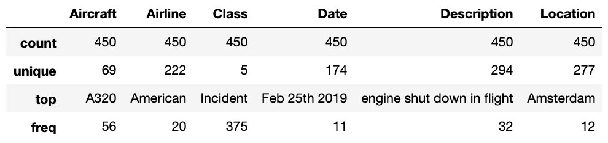

# AV Herald Web Scraping Blog Post
Full blog post can be foud [HERE](https://medium.com/@sjackson2010/aviation-insights-9c13d8640661?source=friends_link&sk=870704f8b6c423120d357526bfc961c5)

## Backstory
After experiencing a take-off abortion on a flight and given little information on the cause, I was curious to find out why the pilot decided the plane was not safe to take off.  I never found the reason, but I did find a web-scraping project.

## The Data
Data was scraped from [Aviation Herald](http://avherald.com/), a site that tracks aviation incidents and news. My dataframe contained 450 headlines that were posted on dates ranging from Dec 10th, 2018 - March 23, 2019.  The result of my scrape was formatted in a pandas data frame that looked like this: 

## Some Findings
### 1. Engine shutdowns in flight are not uncommon

### 2. North American Airlines were the most commonly mentioned in the 450 headlines analyzed

*It's important to note that I didn't do any research to combine related airlines.  For example, Aeromexico and Aeromexico Connect are considered different airlines within my data* 
### 3. The B38M (now grounded) was not the most common aircraft mentioned in recent headlines

*It's important to note here that details on the usage of aircraft would have made these numbers more meaningful*
### 4. Engines, landings, and bird strikes are big problems in aviation
The wordcloud below was made from all of the descriptions of the 450 headlines analyzed.

### 5. Mondays are hard for the aviation industry

### 6. Luckily, of all headlines, only about 14% were about Accidents or Crashes

